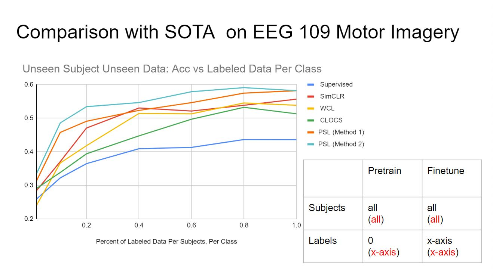
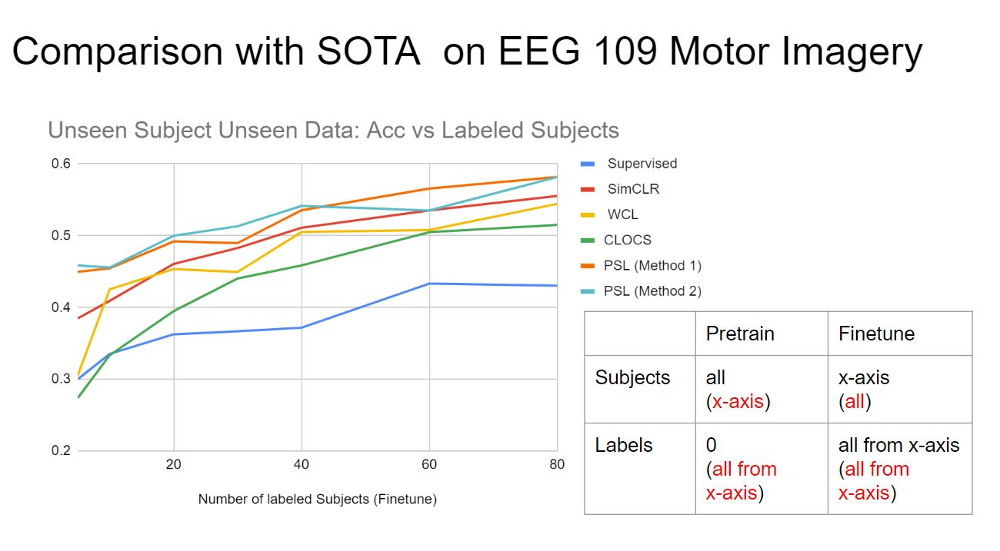
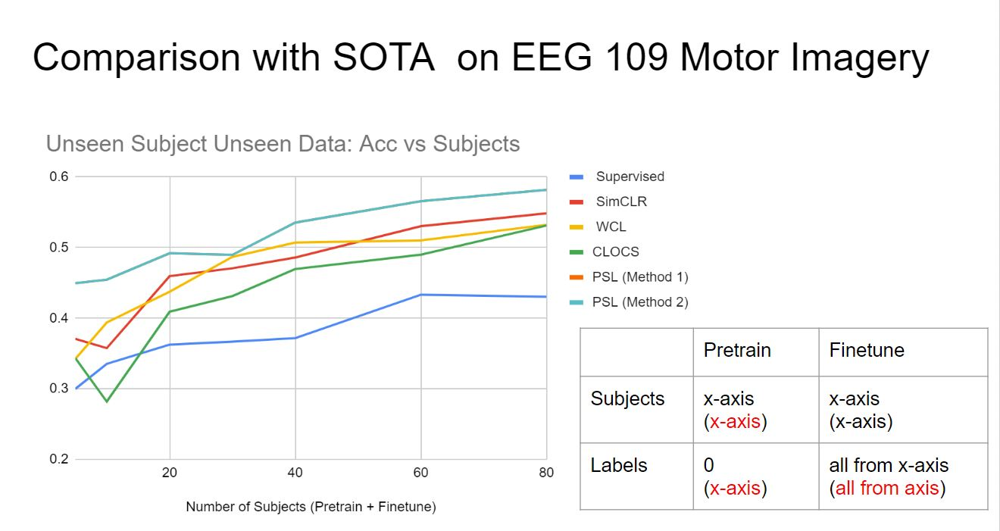

# Biosignal-Processing

## Environment Setup
- linux 
- Anaconda3

All necessary envronment setups are included in environment.yml: 
```
conda env create -f environment.yml 
```
will help install all dependencies.

## Run Experiments
```
python3 unsupervised.py \
          --method PSL --backbone CNN --lr 0.001 --epochs 200 --dataset EEG109\
          --dataset_path {dataset path}.npy\
          --seq_length 646 --input_dim 64 --c2 128 --c3 128 --out_dim 64 --kernel 5 --stride 2 --first_kernel 5 \
          --first_stride 2 --mlp_hidden_size 128 --projection_size 64  --predictor_mlp_hidden_size 512 \
          --patience 10 --temperature 0.1\
          --train_ratio 0.8 --train_ratio_all 0.8 --val_ratio 0.1 --test_ratio 0.1 --batch_size 128 \
          --final_dim 4 --labeled_data_all 0.8 --labeled_data $labeled_data --p1 0.2 --p2 0.2 --p3 0.2 --la 1
  python3 supervised.py \
          --method PSL --backbone CNN --lr 0.0001 --epochs 1000 --dataset EEG109 \
          --dataset_path {dataset path}.npy\
          --seq_length 646 --input_dim 64 --c2 128 --c3 128 --out_dim 64 --kernel 5\
          --stride 2 --first_kernel 5 --labeled_data $labeled_data \
          --first_stride 2 --patience 100 --train_ratio 0.8 --val_ratio 0.1 \
          --test_ratio 0.1 --final_dim 4 --pretrained
```

**Important Hyperpaprmeters**

```train_ratio:``` percent of labeled subjects

```train_ratio_all:``` percent of subjects

```labeled_data:``` percent of labeled data per subject

```labeled_data_all:``` percent of data per subject 

## Details of Implementations
  - Backbone/: it is the DL model architecture used for both pretraining and supervised training 
      - CNN_Backbone.py: Contrastive learning backbone of CNN model
      - Transformer_Backbone.py: Contrastive learning backbone of Transformer model
  - Baselines/
      - SimCLR.py: The most classic contrastive learning approach [2] 
      - BYOL.py: The first contrastive learning framework with two neural networks, referred to as online and target networks, that interact and learn from each other [1]
      - MocoV3.py: A recent contrasntive learning framework with two neural networks with ViT backbones [3]
      - CLOCS.py: The most classic contrasntive learning framework for biosignal processing [4]
      - MAE.py: An auto-regression self-supervised learning framework that learns how to reconstruct the masked input information [5]
      - WCL.py: Weakly-supervied contrastive learning that boosts the contrastive learning process by guessing some pseudo labels [6]
      - PSL.py: Pairwise supervised contrsative learning proposed by us (more details are included in the following sections)
  - Preprocess_Data: raw data preprocessing for different datasets
      - load_chapman_ecg.py / read_HaLT12.py / read_edf78.py / read_eeg109.py / read_emg22.py / read_ofner.py
  - augmentation.py: Candidate data augmentation approaches
  - dataset.py: Dataloaders for each dataset (supervised learning of PSL and supervised & unsupervised learning of the other baseline methods)
  - dataset_pretrain.py: Dataloader for each dataset (unsupervised learning of PSL)
  - supervised.py: Supervised learning framework (that calls training functions in train.py)
  - train.py: Training functions for  un/supervised training, un/supervised evaluation.
  - unsupervised.py: Unsupervised learning framework (that calls training functions in train.py)
  - utils.py: Utilization functions
  - v.py: Visualization fuctions for an intuitive observation of whether the constrastive learning backbones can distinguish the differences between different classes

## Datasets
- EEG109: 64 channel eeg data of 109 subjects recording motor imagery and motor executation [9][10][11] 
- BCI-IV 2a: 22 channel eeg data of 9 subjects recording motor imagery [14]
- EDF78: single channel eeg data of 78 subjects recording eeg signals while the people are sleeping [11][12][13] (This dataset is excluded from the project due to the task type is not related to motor imagery/executation)
- EMG22: 12-channel emg signals of 22 subjects recording basic movements of the fingers and of the wrist and grasping and functional movements [7][8] (This dataset is excluded from the project due to the extreme high number of classes: 40)
- HALT12: 19-channel eeg signals of 12 subjects recording motor imagery of hand/leg/tongue [26][27]


## Motivation && Problem Defination
With some preliminary experiment results, we find that the biosignals such as EEGs of motor imagery are different among subjects. These differences bring the diffculties in cross-subject biosignal classification tasks. For example, if we train the DL model on first n subjects (each subject k data samples) while test the remaining m subjects (each subject k data samples), we will have much lower classification accuracy than training on m+n subjects (each subject has k1 data samples)
and test on the same m+n subjects but different data samples (each subject has k2 data samples, k1 + k2 = k). 

The following table is an example on BCI-IV 2a dataset (transformer backbone): 

| Accuracy       | p1    | p2   | p3    | p4   | p5   | p6    | p7   | p8   | p9   | All     |
|----------------|-------|------|-------|------|------|-------|------|------|------|---------|
| non-cross_test | 96.53 | 36.5 | 95.14 | 33   | 71.2 | 47.22 | 95.5 | 97.2 | 74   | 71.81   |
| cross_test     | 45.1  | 20.5 | 40    | 34.4 | 30   | 22.9  | 33.3 | 48   | 43.4 | 34.0625 |

There are 9 subjects in total, with each has 288 trials. The learning taret is a four-class classification (left hand: class 1, right hand: class 2, both feet: class 3, and tongue: class 4) task. In non-cross test part we combine and shuffle the data from all subjects together and train/test them together. This means in each batch, there are equal distributions of the data from different subjects. In cross test session, we conduct training on 8 of the subjects and test it on the 9th subject. This means that the data from the test subject has never been seen before.

Although collecting biosignals from a large amount of subjects can help reduce this gap, There are several costs for the data collecting process:

- **Money/time for the subject number**: The overhead of looking for and training new subjects increase as the number of subejcts increases.
- **Money/time for the label number**: The efforts of labeling data increases as the number of data needs to be labeled increases.

Due to the high cost of time and money, most datasets only contain less than 40 subjects in total. 

Based on theses observations, we want to explore if we can have a data efficient method that enables the model to learn the essential information from the given subjects and can be applied to unknown subjects. Contrastive learning is a popular approach to help DL models with less labeled data to achieve better performance. However, the previous contrastive learning methods only focus on number of labeled data per class. The cost of looking for & training subjects and label for signals are both non-trivial. Then we propose three experiment settings for our contrastive learning approach:

If there are m+n subjects in total, all training & validation data comes from first n subjects and test data from m subjects. There are no overlapping of subjects between train/val and test.
- **Labeled Data Per Subject vs Accuracy**: Variation in the number of labeled data per subjects versus accuracy change
- **Labeled Subjects vs Accuracy**: Variation in the number of labeled subjects versus accuracy change 
- **Subjects vs Accuracy**: Variation in the number of subjects versus accuracy change, here all avaliable subjects are labeled and there are no unlabeled subjects can be used

## Solution
There are two key points in our solution:
### 1. Label reorganization
We observe that even for the same class, the data from different subjects is quite different from each other. However, if we do some arithmic calculations such as substracting a common shift factor within the  same subject can help the data from same class but different subjects share more common features.

Instead of directly extracting the difference among different classes while ignoring the differeces in subjects, we first calculate the difference among classes within each subject. We can call this intra-subject-difference. In this way, we can augment the class number from 4 to 7. After it, we shuffle this intra-subject-difference among all subjects. This can help the classifier to distinguish the class differences instead of only the classes, which further makes the learning process more easier for the model. 


### 2. Semi-supervised learning with both labeled & unlabeled data
In our 3 experiment settings, there are a part of the unlabeled data which can nor be used in the "Label reorganization" step. Then we propose an entropy based semi-supervised loss. Although we do not have labels for some data, but we have an intuition that one piece of the unlabled data should have 
- similar distances between the labeled data from the same class
- different distances between the labled data from different class
- the distance between one of the classes should have the lowest distance, beacuse the data must be belong to one of the classes


## Current Status 
### Sota accuracy on EEG109 dataset



| Number of labeled data |  0.01  |   0.1  |   0.2  |   0.4  |   0.6  |   0.8  |    1   |
|:----------------------:|:------:|:------:|:------:|:------:|:------:|:------:|:------:|
|        Supervised      | 0.2596 | 0.3222 | 0.3646 | 0.4091 | 0.4131 | 0.4364 | 0.4363 |
|          SimCLR        | 0.2848 | 0.3707 | 0.4707 | 0.5303 | 0.5212 | 0.5384 | 0.5566 |
|           WCL          | 0.2414 | 0.3667 | 0.4182 | 0.5141 | 0.5131 | 0.5454 | 0.5384 |
|          CLOCS         | 0.2909 | 0.3384 | 0.3939 | 0.4475 |  0.497 | 0.5323 | 0.5131 |
|        PSL (Ours)      | 0.2808 | 0.4081 |  0.499 | 0.5333 | 0.5606 | 0.5767 | 0.5838 |
|     PSL (Method 1)     | 0.3141 | 0.4576 | 0.4909 | 0.5232 | 0.5464 | 0.5747 | 0.5818 |
|     PSL (Method 2)     | 0.3353 | 0.4858 | 0.5343 | 0.5465 | 0.5788 | 0.5909 | 0.5818 |



| Number of labeled subjects |    5   |   10   |   20   |   30   |   40   |   60   |   80   |
|:--------------------------:|:------:|:------:|:------:|:------:|:------:|:------:|:------:|
|          Supervised        |   0.3  | 0.3353 | 0.3626 | 0.3667 | 0.3717 | 0.4333 | 0.4303 |
|            SimCLR          | 0.3848 | 0.4091 | 0.4606 | 0.4828 | 0.5111 | 0.5353 | 0.5555 |
|             WCL            |  0.305 | 0.4252 | 0.4535 | 0.4495 | 0.5051 |  0.508 | 0.5444 |
|            CLOCS           | 0.2737 | 0.3333 | 0.3949 | 0.4404 | 0.4586 |  0.505 | 0.5151 |
|         PSL (Ours)         | 0.4121 | 0.4545 |  0.497 |  0.503 | 0.5252 | 0.5798 | 0.5889 |
|       PSL (Method 1)       | 0.4495 | 0.4545 | 0.4919 | 0.4897 | 0.5354 | 0.5657 | 0.5818 |
|       PSL (Method 2)       | 0.4586 | 0.4556 |   0.5  | 0.5131 | 0.5414 | 0.5353 | 0.5818 |



| Number of subjects |    5   |   10   |   20   |   30   |   40   |   60   |   80   |
|:------------------:|:------:|:------:|:------:|:------:|:------:|:------:|:------:|
|      Supervised    |   0.3  | 0.3353 | 0.3626 | 0.3667 | 0.3717 | 0.4333 | 0.4303 |
|        SimCLR      | 0.3707 | 0.3576 | 0.4596 | 0.4707 | 0.4859 | 0.5303 | 0.5485 |
|         WCL        | 0.3424 | 0.3939 | 0.4374 | 0.4869 | 0.5071 | 0.5101 | 0.5323 |
|        CLOCS       | 0.3434 | 0.2818 | 0.4091 | 0.4313 | 0.4697 | 0.4899 | 0.5313 |
|     PSL (Ours)     | 0.4121 | 0.4545 |  0.497 |  0.503 | 0.5252 | 0.5798 | 0.5889 |
|   PSL (Method 1)   | 0.4495 | 0.4545 | 0.4919 | 0.4897 | 0.5354 | 0.5657 | 0.5818 |
|   PSL (Method 2)   | 0.4495 | 0.4545 | 0.4919 | 0.4897 | 0.5354 | 0.5657 | 0.5818 |

### Limited performance on HALT12 dataset

Because the HALT dataset only contains 12 subjects, we only split the training/test subjects by 11:1. Different random seeds bring different combinations of the train/test dataset.

|   Random Seed   |   37   |    0   |   10   | 888888 |
|:---------------:|:------:|:------:|:------:|:------:|
| Test Subject Id |   11   |    7   |   10   |    3   |
|    Supervised   | 0.8356 | 0.3505 | 0.6514 | 0.6571 |
|      SimCLR     | 0.8142 | 0.3567 | 0.6195 | 0.6258 |
|    PSL (Ours)   | 0.8413 | 0.3586 | 0.6677 | 0.6165 |

#### Observations & Analysis:
- Both SiimCLR and PSL do not have obvious improvement compared with supervised learning method.
- There are differences in cross subjects accuracy. Neither PSL nor SimCLR can reduce the gap between the subjects.
- Maybe a larger subject number can reduce the gap.


## Solutions
### 1. Explorations on more datasets
PSL currently only has sota performance on EEG109 datasets and does not have much differences between the other contrastive learning approaches on other datasets. Looking for more datasets (such as Cho2017 [15][17]) with larger subject number may help with the problem. 

Here are some helpful links: 
1. http://moabb.neurotechx.com/docs/datasets.html#motor-imagery-datasets

2. https://physionet.org/

3. https://openbci.com/community/publicly-available-eeg-datasets/

### 2. Explorations on the effectiveness of the transformer based pairwise modules (Theory/Experiment)
We should figure out why the pairwise difference modules help on EEG19 dataset. We can do this either from mathematic side or ablation study.
- Mathematic/theory: a prove of the intra-subject difference moduel can help to reduce the personalization differences.
- Ablation Study: a breakdown of the accuracy change by deleting each part

### 3. More comprehensive baselines: contrastive learning for biosignal processing
We should also add more baselines methods that speciaffically proposed for biosignal processing. Here are some candidate baselines:
**Here is a collection of related works/baselines**
- General contrastive learning. (SimCLR[2], BYOL[1])
- Supervised contrastive learning (SCL)
- Contrastive learning for general time series. (TPC[19], TFC[18])
- Contrastive learning for bio-signals considering variances in subjects.  (BENDR[24], CLOCS[4], SACL[25])


## References
[1] Grill, Jean-Bastien, et al. "Bootstrap your own latent-a new approach to self-supervised learning." Advances in neural information processing systems 33 (2020): 21271-21284.

[2] Chen, Ting, et al. "A simple framework for contrastive learning of visual representations." International conference on machine learning. PMLR, 2020.

[3] Chen, Xinlei, Saining Xie, and Kaiming He. "An empirical study of training self-supervised vision transformers." Proceedings of the IEEE/CVF International Conference on Computer Vision. 2021.

[4] Kiyasseh, Dani, Tingting Zhu, and David A. Clifton. "Clocs: Contrastive learning of cardiac signals across space, time, and patients." International Conference on Machine Learning. PMLR, 2021.

[5] He, Kaiming, et al. "Masked autoencoders are scalable vision learners." Proceedings of the IEEE/CVF Conference on Computer Vision and Pattern Recognition. 2022.

[6] Zheng, Mingkai, et al. "Weakly supervised contrastive learning." Proceedings of the IEEE/CVF International Conference on Computer Vision. 2021.

[7] Krasoulis, Agamemnon, et al. "Improved prosthetic hand control with concurrent use of myoelectric and inertial measurements." Journal of neuroengineering and rehabilitation 14.1 (2017): 1-14.

[8] http://ninapro.hevs.ch/DB7_Instructions

[9] https://www.physionet.org/content/eegmmidb/1.0.0/

[10] Schalk, G., McFarland, D.J., Hinterberger, T., Birbaumer, N., Wolpaw, J.R. BCI2000: A General-Purpose Brain-Computer Interface (BCI) System. IEEE Transactions on Biomedical Engineering 51(6):1034-1043, 2004.

[11] Goldberger, A., Amaral, L., Glass, L., Hausdorff, J., Ivanov, P. C., Mark, R., ... & Stanley, H. E. (2000). PhysioBank, PhysioToolkit, and PhysioNet: Components of a new research resource for complex physiologic signals. Circulation [Online]. 101 (23), pp. e215–e220.

[12] https://physionet.org/content/sleep-edfx/1.0.0/

[13] B Kemp, AH Zwinderman, B Tuk, HAC Kamphuisen, JJL Oberyé. Analysis of a sleep-dependent neuronal feedback loop: the slow-wave microcontinuity of the EEG. IEEE-BME 47(9):1185-1194 (2000).

[14] https://www.bbci.de/competition/iv/desc_2a.pdf

[15] Cho, Hohyun, et al. "EEG datasets for motor imagery brain–computer interface." GigaScience 6.7 (2017): gix034.

[16] Shin, Jaeyoung, et al. "Open access dataset for EEG+ NIRS single-trial classification." IEEE Transactions on Neural Systems and Rehabilitation Engineering 25.10 (2016): 1735-1745.

[17] http://moabb.neurotechx.com/docs/index.html

[18] TFC: Zhang, Xiang, et al. "Self-supervised contrastive pre-training for time series via time-frequency consistency." arXiv preprint arXiv:2206.08496 (2022).
CLUDA: Ozyurt, Yilmazcan, Stefan Feuerriegel, and Ce Zhang. "Contrastive Learning for Unsupervised Domain Adaptation of Time Series." arXiv preprint arXiv:2206.06243 (2022).

[19] TPC:Tonekaboni, Sana, Danny Eytan, and Anna Goldenberg. "Unsupervised Representation Learning for Time Series with Temporal Neighborhood Coding." International Conference on Learning Representations. 2020.

[20] Emadeldeen Eldele et al. “Time-Series Representation Learning via Temporal and Contextual Contrasting”. In: Proceedings of the Thirtieth International Joint Conference on Artificial Intelligence, IJCAI-21. 2021, pp. 2352–2359.

[21] Yue, Zhihan, et al. "Ts2vec: Towards universal representation of time series." Proceedings of the AAAI Conference on Artificial Intelligence. Vol. 36. No. 8. 2022.

[22] Mohsenvand, Mostafa Neo, Mohammad Rasool Izadi, and Pattie Maes. "Contrastive representation learning for electroencephalogram classification." Machine Learning for Health. PMLR, 2020.

[23] Han, Jinpei, Xiao Gu, and Benny Lo. "Semi-supervised contrastive learning for generalizable motor imagery eeg classification." 2021 IEEE 17th International Conference on Wearable and Implantable Body Sensor Networks (BSN). IEEE, 2021.

[24] Kostas, Demetres, Stephane Aroca-Ouellette, and Frank Rudzicz. "BENDR: using transformers and a contrastive self-supervised learning task to learn from massive amounts of EEG data." Frontiers in Human Neuroscience (2021): 253.

[25] Cheng, Joseph Y., et al. "Subject-aware contrastive learning for biosignals." arXiv preprint arXiv:2007.04871 (2020).

[26] https://figshare.com/collections/A_large_electroencephalographic_motor_imagery_dataset_for_electroencephalographic_brain_computer_interfaces/3917698

[27] Kaya, Murat; Binli, Mustafa Kemal; Ozbay, Erkan; Yanar, Hilmi; Mishchenko, Yuriy (2018): A large electroencephalographic motor imagery dataset for electroencephalographic brain computer interfaces. figshare. Collection. https://doi.org/10.6084/m9.figshare.c.3917698.v1 
