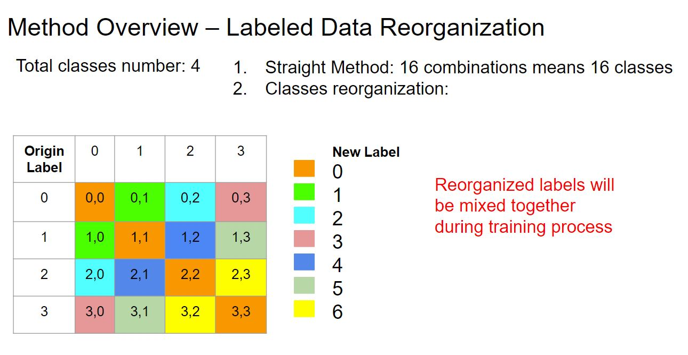
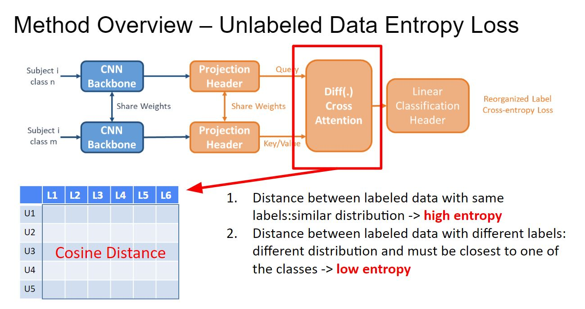

# Biosignal-Processing

## Environment Setup

## Details of Implementations
  - Backbone/
      - CNN_Backbone.py: Contrastive learning backbone of CNN model
      - Transformer_Backbone.py: Contrastive learning backbone of Transformer model
  - Baselines/
      - SimCLR.py: The most classic contrastive learning approach [2] 
      - BYOL.py: The first contrastive learning framework with two neural networks, referred to as online and target networks, that interact and learn from each other [1]
      - MocoV3.py: A recent contrasntive learning framework with two neural networks with ViT backbones [3]
      - CLOCS.py: The most classic contrasntive learning framework for biosignal processing [4]
      - MAE.py: An auto-regression self-supervised learning framework that learns how to reconstruct the masked input information [5]
      - WCL.py: Weakly-supervied contrastive learning that boosts the contrastive learning process by guessing some pseudo labels [6]
      - PSL.py: Pairwise supervised contrsative learning proposed by us (more details are included in the following sections)
  - Preprocess_Data: raw data preprocessing for different datasets
      - load_chapman_ecg.py / read_HaLT12.py / read_edf78.py / read_eeg109.py / read_emg22.py / read_ofner.py
  - augmentation.py: Candidate data augmentation approaches
  - dataset.py: Dataloaders for each dataset (supervised learning of PSL and supervised & unsupervised learning of the other baseline methods)
  - dataset_pretrain.py: Dataloader for each dataset (unsupervised learning of PSL)
  - supervised.py: Supervised learning framework (that calls training functions in train.py)
  - train.py: Training functions for  un/supervised training, un/supervised evaluation.
  - unsupervised.py: Unsupervised learning framework (that calls training functions in train.py)
  - utils.py: Utilization functions
  - v.py: Visualization fuctions for an intuitive observation of whether the constrastive learning backbones can distinguish the differences between different classes

## Datasets
- EEG109: 64 channel eeg data of 109 subjects recording motor imagery and motor executation [9][10][11] 
- BCI-IV 2a: 22 channel eeg data of 9 subjects recording motor imagery [14]
- EDF78: single channel eeg data of 78 subjects recording eeg signals while the people are sleeping [11][12][13]
- EMG22: 12-channel emg signals of 22 subjects recording basic movements of the fingers and of the wrist and grasping and functional movements [7][8]
- Cho2017: 64-channel eeg signals of 52 subjects recording motor imagery of the left and right hands [15][17]

## Motivation && Problem Defination
With some preliminary experiment results, we find that the biosignals such as EEGs of motor imagery are different among subjects. These differences bring the diffculties in cross-subject biosignal classification tasks. For example, if we train the DL model on first n subjects (each subject k data samples) while test the remaining m subjects (each subject k data samples), we will have much lower classification accuracy than training on m+n subjects (each subject has k1 data samples)
and test on the same m+n subjects but different data samples (each subject has k2 data samples, k1 + k2 = k). 

Although collecting biosignals from a large amount of subjects can help reduce this gap, the cost in time and money are expensive. Most datasets only contain 20 to 40 subjects in total. 

Based on theses observations, we want to explore if we can have a data efficient method that enables the model to learn the essential information from the given subjects and can be applied to unknown subjects. Contrastive learning is a popular approach to help DL models with less labeled data to achieve better performance. However, the previous contrastive learning methods only focus on number of labeled data per class. The cost of looking for & training subjects and label for signals are both non-trivial. Then we propose three experiment settings for our contrastive learning approach:

If there are m+n subjects in total, all training & validation data comes from first n subjects and test data from m subjects. There are no overlapping of subjects between train/val and test.
- **Labeled Data Per Subject vs Accuracy**: Variation in the number of labeled data per subjects versus accuracy change
- **Labeled Subjects vs Accuracy**: Variation in the number of labeled subjects versus accuracy change 
- **Subjects vs Accuracy**: Variation in the number of subjects versus accuracy change, here all avaliable subjects are labeled and there are no unlabeled subjects can be used

## Solution
There are two key points in our solution:
### 1. Label reorganization

### 2. Semi-supervised learning with both labeled & unlabeled data

## Current Status && Next Steps
## References
[1] Grill, Jean-Bastien, et al. "Bootstrap your own latent-a new approach to self-supervised learning." Advances in neural information processing systems 33 (2020): 21271-21284.

[2] Chen, Ting, et al. "A simple framework for contrastive learning of visual representations." International conference on machine learning. PMLR, 2020.

[3] Chen, Xinlei, Saining Xie, and Kaiming He. "An empirical study of training self-supervised vision transformers." Proceedings of the IEEE/CVF International Conference on Computer Vision. 2021.

[4] Kiyasseh, Dani, Tingting Zhu, and David A. Clifton. "Clocs: Contrastive learning of cardiac signals across space, time, and patients." International Conference on Machine Learning. PMLR, 2021.

[5] He, Kaiming, et al. "Masked autoencoders are scalable vision learners." Proceedings of the IEEE/CVF Conference on Computer Vision and Pattern Recognition. 2022.

[6] Zheng, Mingkai, et al. "Weakly supervised contrastive learning." Proceedings of the IEEE/CVF International Conference on Computer Vision. 2021.

[7] Krasoulis, Agamemnon, et al. "Improved prosthetic hand control with concurrent use of myoelectric and inertial measurements." Journal of neuroengineering and rehabilitation 14.1 (2017): 1-14.

[8] http://ninapro.hevs.ch/DB7_Instructions

[9] https://www.physionet.org/content/eegmmidb/1.0.0/

[10] Schalk, G., McFarland, D.J., Hinterberger, T., Birbaumer, N., Wolpaw, J.R. BCI2000: A General-Purpose Brain-Computer Interface (BCI) System. IEEE Transactions on Biomedical Engineering 51(6):1034-1043, 2004.

[11] Goldberger, A., Amaral, L., Glass, L., Hausdorff, J., Ivanov, P. C., Mark, R., ... & Stanley, H. E. (2000). PhysioBank, PhysioToolkit, and PhysioNet: Components of a new research resource for complex physiologic signals. Circulation [Online]. 101 (23), pp. e215–e220.

[12] https://physionet.org/content/sleep-edfx/1.0.0/

[13] B Kemp, AH Zwinderman, B Tuk, HAC Kamphuisen, JJL Oberyé. Analysis of a sleep-dependent neuronal feedback loop: the slow-wave microcontinuity of the EEG. IEEE-BME 47(9):1185-1194 (2000).

[14] https://www.bbci.de/competition/iv/desc_2a.pdf

[15] Cho, Hohyun, et al. "EEG datasets for motor imagery brain–computer interface." GigaScience 6.7 (2017): gix034.

[16] Shin, Jaeyoung, et al. "Open access dataset for EEG+ NIRS single-trial classification." IEEE Transactions on Neural Systems and Rehabilitation Engineering 25.10 (2016): 1735-1745.

[17] http://moabb.neurotechx.com/docs/index.html
